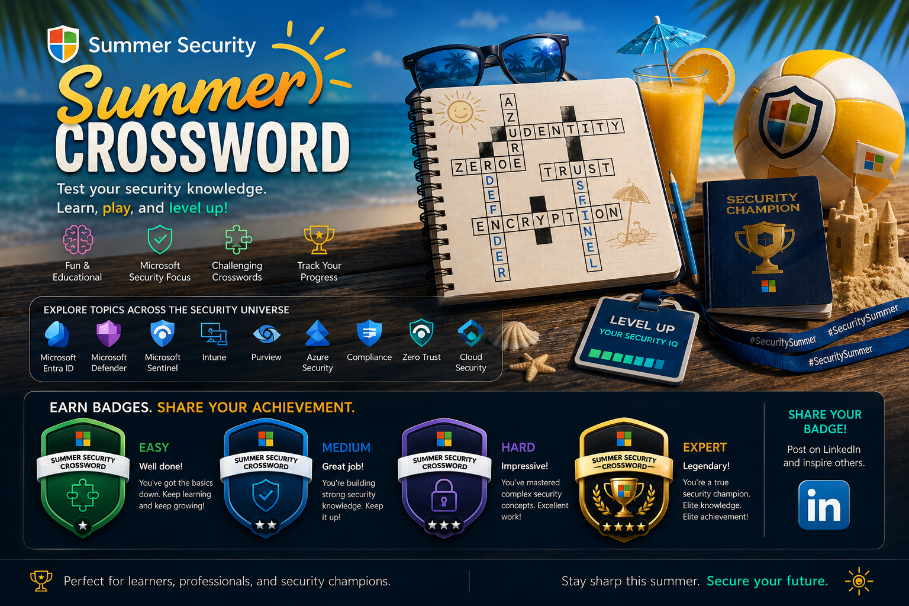
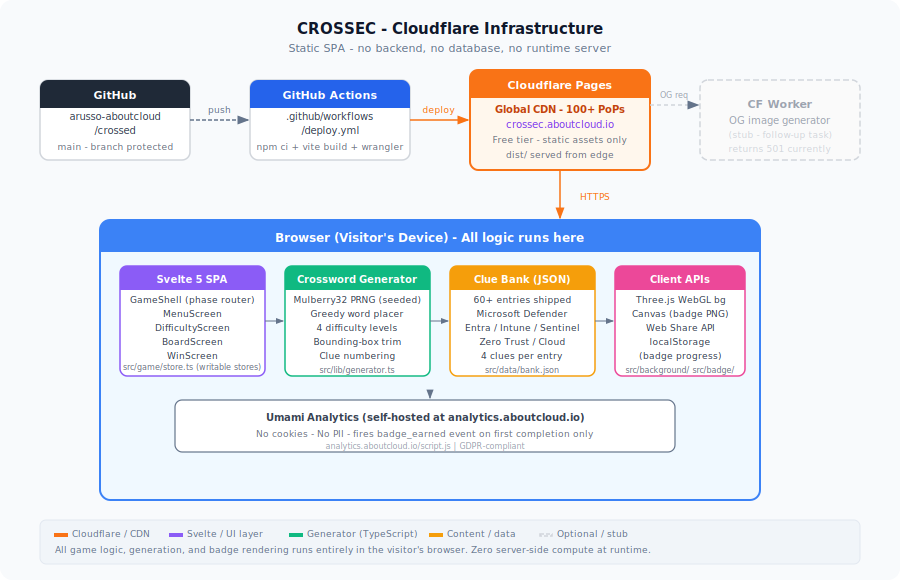

# CROSSEC - Summer Security Crossword

[](https://crossec.aboutcloud.io)
[](LICENSE)
[](LICENSE-CONTENT)
[](src)

A browser-based crossword game on **Microsoft Cloud Security** topics.
Every puzzle is generated fresh in the browser from a shipped clue bank.
No server. No sign-in. No tracking. Zero infrastructure cost.

**Live:** https://crossec.aboutcloud.io | **Blog:** https://blog.aboutcloud.io

---

## Features

- **Random puzzle every session** - seeded procedural generation means no two plays are the same.
- **Four difficulty levels** - Easy, Medium, Hard, Pro. Difficulty changes the clue style, not
  the concept pool; every topic appears at every level.
- **Microsoft Cloud security topics** - Microsoft Defender, Microsoft Sentinel, Microsoft Entra,
  Intune, Azure Security, Purview, Compliance, Zero Trust, and general Cloud Security.
- **Summer WebGL background** - Three.js animated cubes form pixel-art formations (flamingo,
  pineapple, beach ball, toucan, cocktail, rubber duck, waves, and more).
- **Earnable badges** - four difficulty badges generated client-side via Canvas, shareable via
  the Web Share API or download link.
- **Fully static** - served from Cloudflare's global CDN with no origin server. Free tier.
- **Privacy-first** - no cookies, no user accounts. Badge progress lives in localStorage only.

---

## Architecture



See [docs/architecture.md](docs/architecture.md) for the full write-up.

### Short version

```
GitHub push
  -> GitHub Actions (npm ci + vite build + wrangler pages deploy)
     -> Cloudflare Pages (global CDN)
        -> Visitor browser (all game logic runs here)
```

The `dist/` output is a completely static directory. Cloudflare Pages serves it from 100+
edge locations. There is no origin server, no database, and no runtime compute on the server side.

---

## Game Logic

### Crossword generation

Every game starts by calling `generate(entries, difficulty, seed)` in `src/lib/generator.ts`:

| Step | What happens |
|------|-------------|
| 1. Seed | Caller generates a random 31-bit seed. Mulberry32 PRNG (`src/lib/rng.ts`) derives a deterministic sequence - same seed always produces the same puzzle. |
| 2. Pool | `getAllEntries()` loads all bank entries. The array is PRNG-shuffled. |
| 3. Placement | First word placed horizontally at grid centre. Each subsequent word must share a letter with an existing word (connected graph). A scoring function (`scorePlacement`) prefers more crossings. Runs until `targetWords` reached or 4000 attempts exhausted. |
| 4. Trim | Grid is trimmed to the tightest bounding box of placed words. |
| 5. Numbering | Words sorted top-left to bottom-right; each unique start cell gets the next clue number. |
| 6. Clue text | `entry.clues[difficulty]` selected for each placed word. Same grid, four possible clue sets. |

### Per-difficulty parameters

| Difficulty | Grid size | Target words | Clue style |
|------------|-----------|-------------|------------|
| Easy | 9-11 cells | 8 | Definition / recognition |
| Medium | 11-13 cells | 12 | Applied knowledge |
| Hard | 13-15 cells | 16 | Precise, acronym-driven |
| Pro | 15-17 cells | 20 | Scenario-based, edge knowledge |

### Player interaction

1. Player taps/clicks a cell to focus it. The active direction (across/down) is shown in the
   clue panel.
2. Keyboard input fills cells left-to-right / top-to-bottom along the active word.
3. On mobile a hidden `<input>` element captures the virtual keyboard without showing a
   native text field. The input is positioned off-screen and receives focus programmatically.
4. `checkWin()` runs on every keystroke by comparing the current `entries` store against
   `puz.cells` (the ground-truth letter map).
5. On win, `triggerWin()` transitions the phase to `'win'`, stops the timer, and hands a
   `WinResult` to `WinScreen.svelte`.

### Badge system

- `src/badge/renderer.ts` draws a badge PNG on an HTML5 Canvas element.
- `src/game/badgeMemory.ts` persists earned badges in `localStorage` under the key
  `crossed_earned_badges` as `Partial<Record<Difficulty, EarnedEntry>>`.
- Each difficulty slot can only be earned once (first completion wins). A faster replay
  overwrites the stored time but does not "un-earn" the badge.
- Sharing uses the Web Share API where available, with a `<a download>` fallback.

---

## Application Logic

### Component tree

```
src/main.ts
  App.svelte
    WebGLBackground.svelte      <- Three.js canvas, z-index 0, always visible
    GameShell.svelte             <- Phase router (menu/difficulty/playing/paused/win)
      MenuScreen.svelte          <- Landing page: CROSSEC title, badge board, play button
      DifficultyScreen.svelte    <- Difficulty picker
      BoardScreen.svelte         <- Active game
        CrosswordBoard.svelte    <- Grid cells, cell focus, keyboard + touch input
        ClueList.svelte          <- Across / down clue panels with scroll
        PauseOverlay.svelte      <- Pause modal
      WinScreen.svelte           <- Confetti, badge display, share / download
      RulesOverlay.svelte        <- How to play modal (rendered from any phase)
```

### State management

All shared state lives in `src/game/store.ts` as Svelte writable stores:

| Store | Type | Purpose |
|-------|------|---------|
| `gamePhase` | `'menu' | 'difficulty' | 'playing' | 'paused' | 'win'` | Current screen |
| `puzzle` | `GeneratorResult | null` | Active puzzle (cells, placed words, clue maps) |
| `entries` | `Record<string, string>` | Player's letter inputs, keyed `"row,col"` |
| `focusKey` | `string` | Currently focused cell `"row,col"` |
| `activeDir` | `'across' | 'down'` | Input direction |
| `difficulty` | `Difficulty` | Selected difficulty |
| `elapsedSeconds` | `number` | Timer (incremented by setInterval) |
| `soundEnabled` | `boolean` | Sound on/off (default on) |
| `winResult` | `WinResult | null` | Set on win, consumed by WinScreen |

### Clue bank schema

`src/data/bank.json` - a flat JSON array. Each entry:

```json
{
  "id": "conditionalaccess",
  "answer": "CONDITIONALACCESS",
  "display": "Conditional Access",
  "topic": "entra",
  "era": "current",
  "clues": {
    "easy":   "Entra ID policy that can block or allow sign-in based on conditions",
    "medium": "Entra feature that enforces requirements like MFA or compliant device at auth time",
    "hard":   "Named policy type evaluated by the Entra ID token issuance pipeline",
    "pro":    "Policy engine that evaluates user, device, location and app signals before issuing tokens"
  }
}
```

Fields: `id` (stable slug), `answer` (A-Z only), `display` (UI label), `topic`, `era`
(`current` / `legacy`), `clues` (4 strings).

See [docs/difficulty.md](docs/difficulty.md) for the full clue authoring guide.

---

## Security and Privacy

CROSSEC is a fully static, client-side application. The attack surface is intentionally minimal.

| Concern | Status |
|---------|--------|
| **No backend** | There is no server-side code running at request time. All logic is in the browser. |
| **No user data stored server-side** | Badge progress is localStorage-only. Nothing is sent to any server. |
| **No authentication** | There are no accounts, sessions, or tokens to steal. |
| **No external API calls at runtime** | The only external request is the Umami analytics script (no cookies, no PII). |
| **XSS** | Svelte's template system HTML-escapes all dynamic values by default. Clue strings from the bank are rendered as text nodes. |
| **Supply chain** | Dependabot monitors npm and GitHub Actions dependencies weekly. |
| **Secrets** | No secrets are in the repository. The Cloudflare API token lives only in GitHub Actions secrets. |
| **CSP** | Served by Cloudflare Pages; a CSP header can be added via `_headers` without code changes. |
| **HTTPS** | Enforced by Cloudflare Pages; HTTP is redirected automatically. |

### Reporting a vulnerability

Please do not open a public GitHub issue. Use GitHub's private vulnerability disclosure
(Security tab > "Report a vulnerability") or email `security@aboutcloud.io`.
See [SECURITY.md](SECURITY.md) for the full policy.

---

## Local Development

```bash
# Clone
git clone https://github.com/arusso-aboutcloud/crossed.git
cd crossed

# Install
npm install

# Dev server (hot reload at http://localhost:5173)
npm run dev

# Run tests
npm test

# Production build (output in dist/)
npm run build

# Preview the production build locally
npm run preview
```

No environment variables are required for local development.

---

## Deployment

### Cloudflare Pages (automated)

Every push to `main` triggers the GitHub Actions workflow in
`.github/workflows/deploy.yml`. The workflow runs `npm ci`, `vite build`, and
`wrangler pages deploy dist/`.

### Cloudflare Pages (manual)

```bash
npm run build
npx wrangler pages deploy dist --project-name crossed --branch main
```

### Self-hosted

Serve the `dist/` directory from any static web server - nginx, Caddy, Apache, or any CDN.
No server-side rendering or runtime dependencies. The optional Cloudflare Worker (`worker/`)
is a separate deployment for OG image generation; it can be omitted entirely.

---

## Cloudflare Pages build settings

| Setting | Value |
|---------|-------|
| Build command | `npm run build` |
| Build output directory | `dist` |
| Root directory | `/` |
| Node.js version | 22 |

No environment variables are required for the static build itself.

---

## Contributing

Contributions are welcome. The most impactful areas are:

- **Clue bank entries** - new Microsoft Cloud security entries following the schema in
  `src/data/bank.json`. Every entry needs all four clue variants and a unique lowercase
  hyphenated `id`.
- **New WebGL formations** - pixel-art formations defined in `src/background/formations.ts`
  as `{ col, row, color }` slot arrays.
- **Bug fixes** - especially cross-browser rendering or accessibility issues.

Before opening a PR, check the checklist in [`.github/pull_request_template.md`](.github/pull_request_template.md):

- ASCII-only in all files (no smart quotes, em-dashes, or non-ASCII punctuation).
- No secrets, tokens, or account IDs committed.
- `npm run build` and `npm test` pass locally.

---

## Project structure

```
crossed/
+-- src/
|   +-- background/      Three.js WebGL background (formations, WebGLBackground.svelte)
|   +-- badge/           Badge Canvas renderer and renderer tests
|   +-- data/            bank.json - the clue bank (CC-BY-4.0)
|   +-- dev/             Dev harness for isolated component testing
|   +-- game/            Svelte components, store, badge memory, game logic
|   +-- lib/             Generator, types, RNG, bank accessors
|   +-- styles/          Global CSS (app.css)
|   +-- main.ts          Entry point
|   +-- App.svelte       Root component
+-- public/
|   +-- badges/          SVG badge images (easy/medium/hard/pro)
|   +-- brand/           Social platform SVG logos
|   +-- fonts/           PressStart2P.woff2 (self-hosted pixel font)
|   +-- sounds/          xp-startup.mp3 (optional game start sound)
+-- docs/
|   +-- architecture.md  Full architecture write-up
|   +-- difficulty.md    Difficulty system and clue authoring guide
|   +-- assets/          Diagrams and images for documentation
+-- worker/              Cloudflare Worker stub (OG image generator, follow-up task)
+-- scripts/             Build-time scripts (gen-og.mjs)
+-- .github/             Workflows, CODEOWNERS, PR template, Dependabot config
+-- index.html           Vite HTML entry
+-- vite.config.ts       Vite configuration
+-- svelte.config.js     Svelte configuration
+-- tsconfig.json        TypeScript configuration
```

---

## License

- **Code** (all files except `src/data/bank.json`): [MIT License](LICENSE)
- **Clue bank content** (`src/data/bank.json`): [CC-BY-4.0](LICENSE-CONTENT)

Content contributors retain attribution under CC-BY-4.0. Commercial use of the clue bank
requires attribution to the `crossed` project and the aboutcloud.io community.
